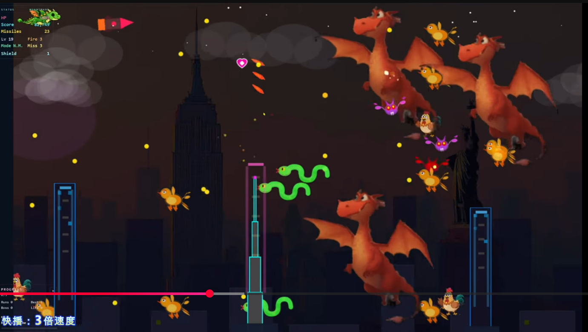
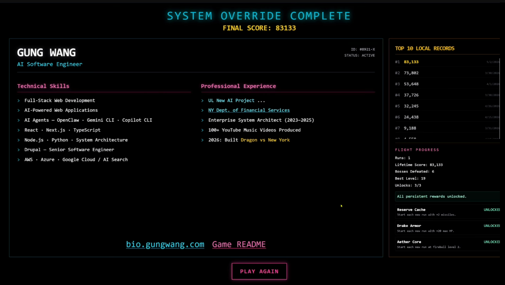
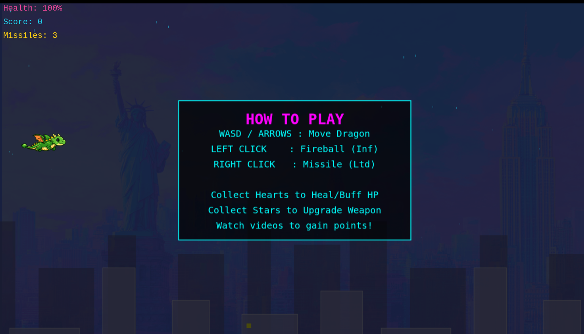
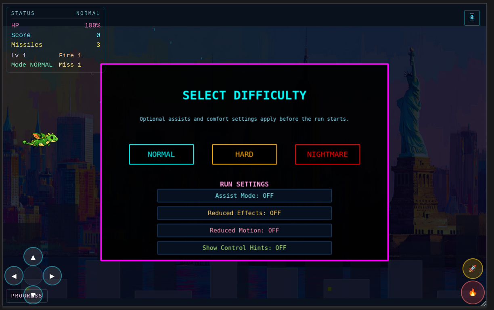
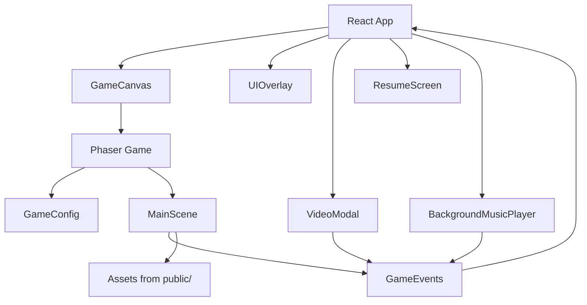

# Dragon vs New York

[中文说明](./README_CN.md)

[](./LICENSE)


A cyberpunk-themed 2D side-scrolling web shooter built with React, Phaser 3, and TypeScript.

You pilot a dragon across Manhattan, fight mutated farm-animal monsters on rooftops, trigger music-video moments between stages, and finish the run with a resume-style ending screen. The project is designed as both a game and a personal portfolio experience.

- GitHub: https://github.com/gungwang/home-game
- Demo: https://gungwang.com/

## Screenshots
### Mobile Friendly & Mobile Control





## Gameplay Video


If the animated preview does not render on your GitHub client, open it directly: [dragon-newyork1-gif.gif](./dragon-newyork1-gif.gif)

## Highlights

- Cyberpunk Manhattan skyline with weather, lighting, and day/night transitions
- Dual-weapon combat with fireballs, missiles, upgrades, and boss encounters
- YouTube MV integration between level milestones
- Resume and portfolio presentation after game completion
- Keyboard and mouse controls for arcade-style movement and combat

## Tech Stack

- React 19
- TypeScript
- Phaser 3
- Vite
- Tailwind CSS
- react-youtube

## Getting Started

### Prerequisites

- Node.js 20 or newer recommended
- npm 10 or newer recommended

### Installation

```bash
git clone https://github.com/gungwang/home-game.git
cd home-game
npm install
```

### Start the Development Server

```bash
npm run dev
```

Then open the local URL shown by Vite, usually `http://localhost:5173`.

If port `5173` is already in use, Vite automatically selects another available port.

## Available Scripts

```bash
npm run dev      # start the local dev server
npm run build    # type-check and create a production build
npm run preview  # preview the production build locally
```

## Controls

- Move: `WASD` or arrow keys
- Fireball: left mouse button
- Missile: right mouse button

## Project Structure

```text
src/
	components/           React UI and overlay components
	game/                 Phaser configuration, events, and scenes
	App.tsx               top-level application shell
public/                 sprites, backgrounds, sound effects, and icons
docs/                   design notes and feature plans
```

## Architecture



## Roadmap

- Improve stage variety across Manhattan districts and boss pacing
- Expand enemy types, attack patterns, and upgrade combinations
- Add richer content transitions between gameplay, video moments, and resume scenes
- Improve onboarding, difficulty tuning, and mobile-friendly presentation
- Add stronger automation for regression checks and content QA

## Development Notes

- The main gameplay loop lives in `src/game/scenes/MainScene.ts`
- React components in `src/components/` handle overlays, video playback, and resume screens
- Vite is configured to build both the game entry page and `README.html`

## Contributing

Contributions, balancing ideas, bug reports, and content improvements are welcome.

- Contribution guide: [CONTRIBUTING.md](./CONTRIBUTING.md)
- Code of conduct: [CODE_OF_CONDUCT.md](./CODE_OF_CONDUCT.md)

## License

This project is licensed under the MIT License. See [LICENSE](./LICENSE) for details.

## deploy to cloudflare website
npm run build && npx wrangler pages deploy dist --project-name=dragon-game --commit-dirty=true 2>&1 | cat
