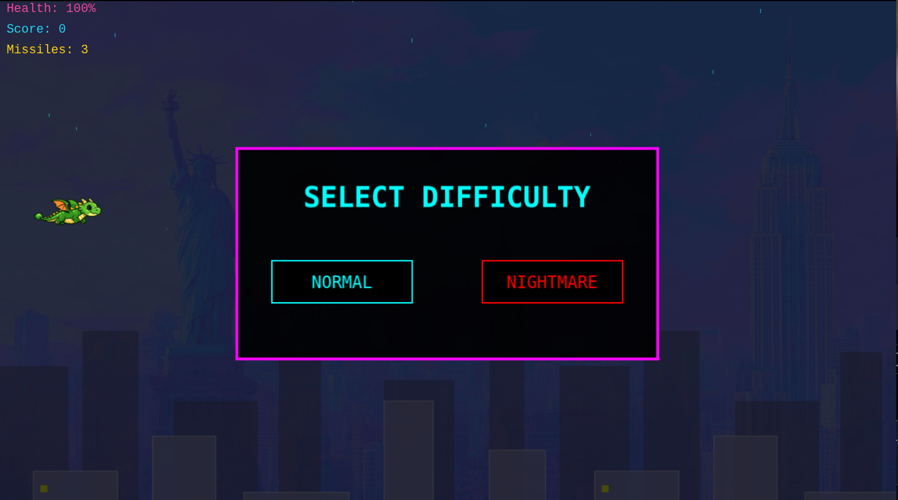
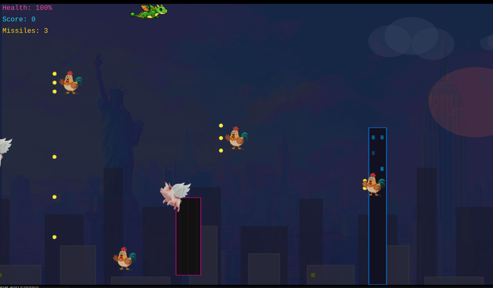

# 飞龙大战纽约 | Dragon vs New York

## 简体中文

赛博朋克风格的2D横版网页射击游戏，基于 React + Phaser 3 + TypeScript 构建。

玩家操控神龙在纽约曼哈顿上空飞行，消灭变异家畜妖怪，穿越高楼大厦，每过一关观看一个YouTube音乐视频。通关后展示个人简历。

### 特性

- **赛博朋克视觉风格** — 深色背景、霓虹配色、天气系统（雨、雪、闪电）、日夜循环（白天→黄昏→夜晚→黎明）
- **双武器系统** — 龙息火球（无限弹药）+ 龙刺导弹（有限弹药），武器可升级
- **YouTube视频集成** — 每过一关在大楼表面播放YouTube MV，观看得分
- **Boss战** — 第9关后触发Boss战，击败Boss通关
- **个人简历展示** — 通关后显示专业简历和排行榜
- **键盘操控** — 方向键/WASD移动，空格发射火球，M发射导弹

### 技术栈

- **前端框架**: React 19 + TypeScript
- **游戏引擎**: Phaser 3（Arcade物理引擎）
- **构建工具**: Vite
- **样式**: Tailwind CSS
- **视频播放**: react-youtube

### 快速开始

```bash
npm install
npm run dev
```

### 本地服务器启动

1. 安装依赖：`npm install`
2. 启动本地开发服务器：`npm run dev`
3. 在浏览器打开：`http://localhost:5173`

如果 5173 端口被占用，Vite 会自动切换到其他可用端口，终端里会显示实际访问地址。

### 构建部署

```bash
npm run build
npm run preview
```






---

## English

A cyberpunk-themed 2D side-scrolling web shooter built with React + Phaser 3 + TypeScript.

The player controls a dragon flying over Manhattan, battling mutant farm animals, weaving through skyscrapers, and watching a YouTube music video after each checkpoint. A professional resume is displayed upon completion.

### Features

- **Cyberpunk visuals** — Dark backgrounds, neon palette, weather system (rain, snow, lightning), day/night cycle (Day → Sunset → Night → Sunrise)
- **Dual weapon system** — Dragon breath fireballs (unlimited) + Dragon spike missiles (limited), with weapon upgrades
- **YouTube video integration** — A YouTube MV plays on building surfaces after each checkpoint, earning bonus score
- **Boss battle** — Boss fight triggers after checkpoint 9; defeat the boss to win
- **Resume showcase** — Professional resume and leaderboard displayed on game completion
- **Keyboard controls** — Arrow keys / WASD to move, Space for fireballs, M for missiles

### Tech Stack

- **Frontend**: React 19 + TypeScript
- **Game Engine**: Phaser 3 (Arcade Physics)
- **Build Tool**: Vite
- **Styling**: Tailwind CSS
- **Video Player**: react-youtube

### Quick Start

```bash
npm install
npm run dev
```

### Run Local Server

1. Install dependencies: `npm install`
2. Start the local development server: `npm run dev`
3. Open: `http://localhost:5173`

If port 5173 is already in use, Vite will automatically choose another available port and print the actual local URL in the terminal.

### Build & Deploy

```bash
npm run build
npm run preview
```


