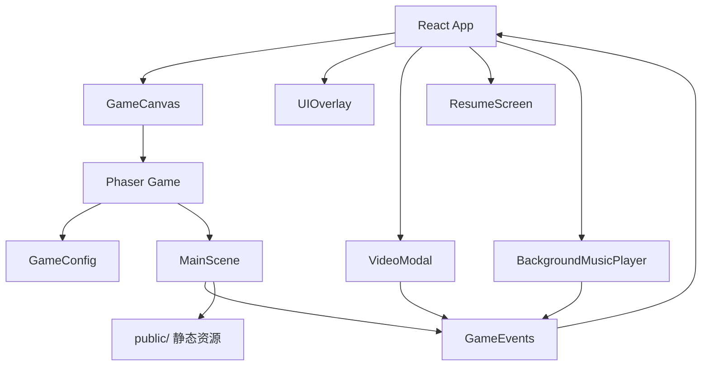

# 飞龙大战纽约


[English](./README.md)

[](./LICENSE)


这是一个基于 React、Phaser 3 和 TypeScript 构建的赛博朋克风格 2D 横版网页射击游戏。

玩家操控神龙飞越纽约曼哈顿，在摩天大楼之间战斗，消灭变异家畜妖怪，在关卡节点触发 YouTube 音乐视频，并在通关后进入简历式结尾页面。这个项目同时也是游戏作品和个人作品集首页。

- GitHub: https://github.com/gungwang/home-game
- 在线演示: https://gungwang.com/

## 游戏截图


## 演示视频

<video src="./dragon-newyork1.mp4" controls muted playsinline width="100%"></video>

如果当前 GitHub 客户端不支持内嵌播放器，可直接打开视频文件：[dragon-newyork1.mp4](./dragon-newyork1.mp4)

## 项目亮点

- 赛博朋克风格的曼哈顿天际线，包含天气、光照和昼夜循环
- 双武器战斗系统，含火球、导弹、升级和 Boss 战
- 在关卡节点嵌入 YouTube MV 播放体验
- 通关后展示简历和个人作品集内容
- 支持键盘和鼠标的街机式操作

## 技术栈

- React 19
- TypeScript
- Phaser 3
- Vite
- Tailwind CSS
- react-youtube

## 快速开始

### 环境要求

- 推荐 Node.js 20 或更高版本
- 推荐 npm 10 或更高版本

### 安装

```bash
git clone https://github.com/gungwang/home-game.git
cd home-game
npm install
```

### 启动开发服务器

```bash
npm run dev
```

然后打开 Vite 在终端输出的本地地址，通常为 `http://localhost:5173`。

如果 `5173` 端口已被占用，Vite 会自动切换到其他可用端口。

如果要测试不同的成长曲线，可以把 [.env.example](./.env.example) 复制为 `.env.local`，然后把 `VITE_PROGRESSION_PRESET` 设置为 `casual`、`returning-player` 或 `arcade`。

开发时也可以直接在浏览器里覆盖当前预设：

```js
localStorage.setItem('dragon-game-progression-preset-override', 'casual')
location.reload()
```

如果想恢复为环境变量或默认预设，清除这个覆盖值即可：

```js
localStorage.removeItem('dragon-game-progression-preset-override')
location.reload()
```

## 可用脚本

```bash
npm run dev      # 启动本地开发服务器
npm run build    # 类型检查并生成生产构建
npm run preview  # 本地预览生产构建
```

## 操作方式

- 移动: `WASD` 或方向键
- 火球: 鼠标左键
- 导弹: 鼠标右键

## 项目结构

```text
src/
	components/           React 界面组件和叠加层
	game/                 Phaser 配置、事件和场景
	App.tsx               顶层应用壳
public/                 精灵图、背景、音效和图标
docs/                   设计文档和功能规划
```

## 架构概览



## 路线图

- 继续丰富曼哈顿各区域的关卡变化和 Boss 节奏
- 扩展敌人类型、攻击模式和武器升级组合
- 强化玩法、视频节点和简历页面之间的内容衔接
- 优化新手引导、难度曲线和移动端展示体验
- 补充更稳定的自动化回归检查和内容 QA

## 开发说明

- 主要游戏逻辑位于 `src/game/scenes/MainScene.ts`
- `src/components/` 中的 React 组件负责 UI、视频弹窗和简历界面
- Vite 同时构建游戏入口页面和 `README.html`
- 在开发模式下，HUD 右上角的进度面板会显示当前成长预设，方便确认配置是否生效

## 参与贡献

欢迎提交功能建议、平衡性想法、Bug 报告和内容优化。

- 贡献指南: [CONTRIBUTING_CN.md](./CONTRIBUTING_CN.md)
- 行为准则: [CODE_OF_CONDUCT_CN.md](./CODE_OF_CONDUCT_CN.md)

## 许可证

本项目采用 MIT 许可证，详情请参见 [LICENSE](./LICENSE)。
